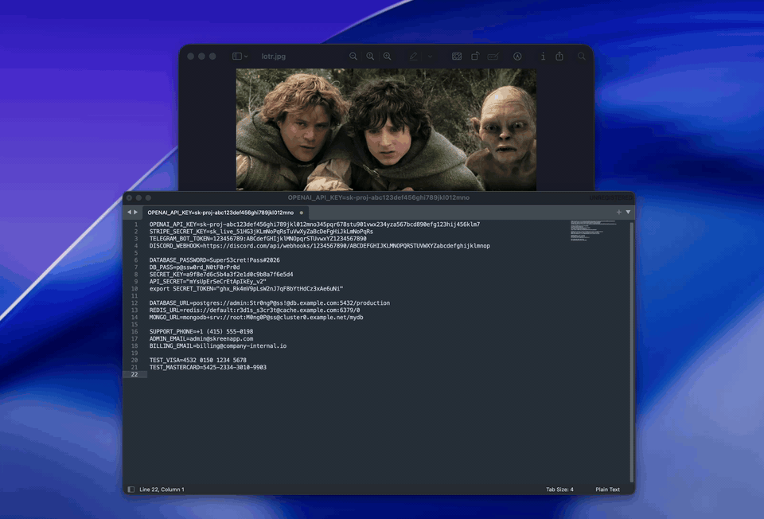

  

<h1 align="center">Skreen[me]</h1>

  Screenshot beautifier for macOS. 
  Lives in the menu bar. Capture, style, share.

  
  
  
  

  <a href="https://github.com/levskiy0/skreenme/releases/latest">Download</a>

  

---

  

Skreen takes your screenshots and code snippets and wraps them in customizable backgrounds, paddings, shadows, and rounded corners.

## Features

**Screenshots** - capture area or window with a global hotkey, style it with gradients, solid colors, or your own image as background. Adjust paddings, corner radius, shadows, frame color. Export as PNG or copy to clipboard.

**Code** - paste a snippet, pick a language and a theme, get a styled code image. Syntax highlighting for 21 languages, 10 themes (Dracula, Monokai, Nord, etc). Export as PNG or SVG.

**Annotations** - arrows, rectangles, ellipses, text, freehand, markers, numbered counters, ruler. Blur and pixelate for redacting sensitive areas.

**Beautify** - one click to auto-pick a matching gradient, padding, shadow, and frame based on your screenshot's colors.

**Privacy** - auto-detects faces and sensitive data (emails, API keys, phone numbers) and redacts them. All processing stays on your Mac.

## Install

Download the `.dmg` from [Releases](https://github.com/levskiy0/skreenme/releases/latest), drag to Applications, launch. Grant Screen Recording permission when prompted.

Requires macOS 14+.

## Updates

Auto-updates via Sparkle. Check manually from the menu bar.

---

[Issues & feedback](https://github.com/levskiy0/skreenme/issues)

Crafted with ❤️

