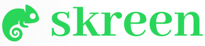

  

# Skreen[me]

**Native macOS screenshot app. Beautify, annotate, auto-redact.**

Capture → Style → Annotate → Redact → Share. Everything on-device. Pure Swift.

---

  

Your screenshot workflow probably looks like this: capture → open Preview to crop → open Figma to add a nice background → open Carbon to make the code pretty → manually blur the API key you almost forgot about → repeat for every single screenshot.

**Skreen collapses that entire chain into one native Mac app that lives in your menu bar.**

No code uploaded to any server. Everything happens on your machine.

---

## Beautiful screenshots without design skills

Hit `⌘⇧0`, draw a region, and Skreen opens with your screenshot already styled — gradient background, rounded corners, shadow. One more click for **Auto-Beautify**: Skreen analyzes your screenshot's dominant colors and picks the gradient + sizing that makes it look best. Not gimmicky. Actually useful.

**48 curated gradient presets** across 8 collections — Vivid, Sunset, Ocean, Cosmic, Neon, Pastel, Dark, Nature.

**13 procedural patterns** — particles, topology, plasma, domain warp, wave lines, and more. Every pattern is unique and regenerates at export resolution.

Or: custom gradient with full color control, solid color, uploaded image, blur overlay, grain texture. It's all there.

**Aspect ratio presets**: Square (1:1), Portrait (4:5), Landscape (16:9), Twitter/X header (2:1), LinkedIn, Story (9:16), or fully custom dimensions.

---

## Code snippets to beautiful images — native, offline, private

Carbon.now.sh hasn't had a meaningful update since late 2024. ray.so requires the Raycast ecosystem. Both are web — your code goes to their servers, you need internet, and you're copy-pasting every time.

Skreen has a native code mode. Paste once, configure once, export anywhere.

- **21 languages**: Swift, JavaScript, TypeScript, Python, Go, Rust, Java, Kotlin, C#, C++, C, Ruby, PHP, HTML, CSS, JSON, YAML, Markdown, SQL, Shell, Plain Text
- **10 themes**: Dracula, GitHub Dark, Monokai, One Dark, Nord, Tokyo Night, GitHub Light, Solarized, Xcode, One Light
- Line numbers, custom window title, PNG or **SVG export**
- Works offline. Your code never leaves the machine.

---

## Auto-redact sensitive data — faces, emails, API keys, and more

This is the part that saves you from yourself.

Every developer has accidentally shared a screenshot with an API key, token, or email visible. Skreen watches for it automatically, using Apple Vision framework — **entirely on-device, zero network calls.**

**What Skreen detects and redacts automatically:**

- Faces
- Email addresses
- API keys & tokens
- Passwords
- Phone numbers
- Credit card numbers
- SSN
- IP addresses
- Custom patterns (your own regex)

Pick the method: **Blur**, **Pixelate**, or **Solid fill** — at soft, medium, or hard intensity. Toggle each type individually. See what was detected. Enable or disable per category.

And for manual redaction: hold `ALT` while using the Redact or Marker tool to snap precisely to individual words detected by Vision OCR. No dragging blind boxes around text anymore.

---

## Annotations that cover real workflows

13 tools. All keyboard-accessible.

| Key | Tool | What it does |
|---|---|---|
| `V` | Pointer | Select, move, resize, delete |
| `P` | Freehand | Free-draw pen |
| `M` | Marker | Highlighter pen — `ALT` to snap to words |
| `A` | Arrow | Straight or curved, single or double-ended, open or filled arrowheads |
| `L` | Line | Straight lines |
| `R` | Rectangle | With optional rounded corners and fill |
| `O` | Ellipse | With optional fill |
| `T` | Text | Plain or badge style, 9 font sizes (12–128 px) |
| `C` | Counter | Numbered step badges — 1, 2, 3… perfect for tutorials |
| `B` | Redact | Blur / pixelate / solid fill — rectangle, ellipse, or freehand shape |
| `U` | Ruler | Visual distance measurement |
| `G` | Magnifier | Zoom lens at 1.5×, 2×, 3×, 4×, or 5× |
| `S` | Sticker | Drop images from your personal sticker library |

Per-tool: stroke color, fill color, width (`1`–`5` keys), arrow style. Full undo/redo stack (`⌘Z` / `⌘⇧Z`). TAB to cycle through annotations.

---

## How Skreen compares

| | **Skreen**        | CleanShot X | Xnapper | Carbon / ray.so | Shottr |
|---|-------------------|---|---|---|---|
| **Price** | Public Beta       | $29 + $19/yr | $30/device | Free (web) | $8–$30 one-time |
| **Screenshot capture** | ✅                 | ✅ | ✅ | ❌ | ✅ |
| **Code mode** | ✅ 21 langs        | ❌ | ❌ | ✅ web only | ❌ |
| **Beautiful backgrounds** | ✅ 48 + procedural | Limited | Limited | Limited | ❌ |
| **Auto-Beautify** | ✅                 | ❌ | ❌ | ❌ | ❌ |
| **Annotations (full)** | ✅ 13 tools        | ✅ | Basic | ❌ | ✅ |
| **Auto PII redaction** | ✅ On-device       | ❌ | Partial | ❌ | ❌ |
| **Word-snap redact** | ✅                 | ❌ | ❌ | ❌ | ❌ |
| **Watermarks** | ✅                 | ❌ | ❌ | ❌ | ❌ |
| **Stickers** | ✅                 | ❌ | ❌ | ❌ | ❌ |
| **Smart Crop** | ✅ Vision AI       | ❌ | ❌ | ❌ | ❌ |
| **Runs offline** | ✅                 | ✅ | ✅ | ❌ | ✅ |
| **SVG export** | ✅                 | ❌ | ❌ | ✅ | ❌ |
| **Menu bar native** | ✅                 | ✅ | ✅ | ❌ | ✅ |

---

## More features worth knowing about

**Crop**: free-form, re-crop without losing the original, or **Smart Crop** — Vision saliency detection finds the most interesting region automatically.

**Watermarks**: text or image. 9-position grid. Adaptive color (auto-contrast). Opacity 15–100%. Inner, outer, or frame placement. For documentation, tutorials, branded content.

**Zoom & pan**: navigate large screenshots without losing context. Reset with one click.

**Sticker library**: drop PNG/JPG files into `~/Library/Application Support/Skreen/Stickers/` — they appear instantly, no restart.

---

## Install

Download, drag to Applications, done. Auto-updates via Sparkle — no need to come back here for new versions.

**[→ Download Skreen](https://github.com/levskiy0/skreenme/releases/latest)**

Requires **macOS 14 Sonoma** or later. Screen recording and accessibility permissions requested on first launch.

---

## Settings worth configuring once

- **Hotkeys**: remap both capture shortcuts to whatever you want
- **Auto-save folder**: configure once, files always land in the right place
- **Auto-close after export**: copy → clipboard → window closes automatically
- **Detection toggles**: enable/disable each PII category independently
- **Custom patterns**: add your own regex for internal data formats (session tokens, internal IDs, etc.)
- **Launch at login**: lives in your menu bar, always ready

---

[Issues & feedback](https://github.com/levskiy0/skreenme/issues) · Crafted with ❤️ for macOS
