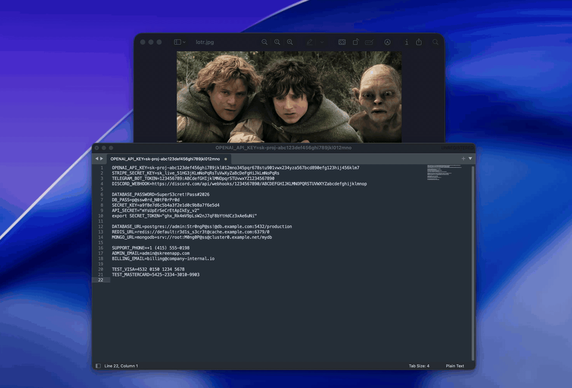

  

<h1 align="center">Skreen[me] — Screenshot Beautifier for macOS</h1>

  Transform screenshots and code snippets into beautiful, shareable images. 
  Custom backgrounds · Annotations · Privacy redaction · Lives in your menu bar.

  
  
  
  

  <a href="https://github.com/levskiy0/skreenme/releases/latest">Download for macOS</a>

---

  

**Skreen[me]** is a native macOS app that turns raw screenshots and code snippets into polished, professional images. Capture with a global hotkey, style with gradients or custom backgrounds, annotate, redact sensitive info — and share in seconds. No subscription. No cloud. Runs entirely on your Mac.

## Screenshot Beautification

Capture any area or window with a global hotkey and instantly wrap it in a custom background. Choose from gradients, solid colors, or your own image. Fine-tune padding, corner radius, shadow depth, and frame color. Export as PNG or copy directly to clipboard.

## Code Screenshots with Syntax Highlighting

Paste a code snippet, select language and theme — get a styled, shareable image. Supports 21 programming languages and 10 themes including Dracula, Monokai, Nord, GitHub, and more. Export as PNG or SVG.

## Annotation Tools

Add context to any screenshot with arrows, rectangles, ellipses, freehand drawing, text labels, markers, numbered counters, and a ruler. Built for documenting bugs, writing tutorials, and creating step-by-step guides.

## Auto-Beautify

One click to automatically pick a matching gradient, optimal padding, shadow, and frame based on the dominant colors of your screenshot. Great results without manual tweaking.

## Privacy & Auto-Redaction

Automatically detects and redacts faces, email addresses, API keys, and phone numbers before you share. All processing runs on-device — nothing leaves your Mac.

## Install

Download the `.dmg` from [Releases](https://github.com/levskiy0/skreenme/releases/latest), drag to Applications, launch. Grant Screen Recording permission when prompted.

Requires macOS 14 Sonoma or later.

## Updates

Auto-updates via Sparkle. Check manually from the menu bar icon.

---

## Compared to CleanShot X, Xnapper, Carbon

| Feature | Skreen[me] | CleanShot X | Xnapper | Carbon / Ray.so |
|---|---|---|---|---|
| Screenshot beautification | ✅ | ✅ | ✅ | ❌ |
| Code screenshots | ✅ | ❌ | ❌ | ✅ |
| Annotation tools | ✅ | ✅ | ❌ | ❌ |
| Auto privacy redaction | ✅ | ❌ | ❌ | ❌ |
| Native macOS app | ✅ | ✅ | ✅ | ❌ (web) |
| No subscription | ✅ | ❌ | ✅ | ✅ |
| Menu bar | ✅ | ✅ | ✅ | ❌ |

---

[Issues & feedback](https://github.com/levskiy0/skreenme/issues) · Crafted with ❤️ for macOS
