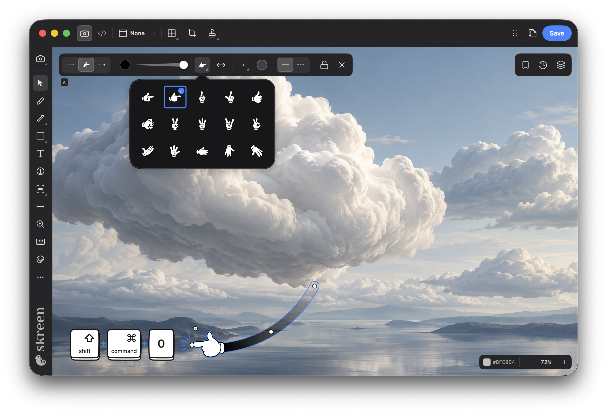

  

**Skreen is a screenshot editor for macOS.**

Capture an area, window, or scrolling page. Edit the image, copy text from it, or cover private details before sharing. Skreen is written in Swift; image processing runs on your Mac.

---

  

Most screenshots need a little work after capture. You might crop away a sidebar, point to a button, or hide an email address.

Skreen opens the capture in its editor and keeps the capture tools in your menu bar.

Text recognition and sensitive-data detection run on your Mac.

---

## Capture

Start any capture mode from the menu bar. You can also set global shortcuts for the actions you use most:

- **Capture Area** (`Shift` + `⌘` + `0` by default) and **Capture Window**
- **Repeat Last Area** without drawing the same selection again
- **Capture with Timer** after 3, 5, 10, or 15 seconds, with an in-selection countdown
- **Scrolling Capture** with explicit start, pause, direction, finish, and cancel controls
- **Capture Text** to recognize text and QR codes directly from a selected area

Scrolling Capture automatically moves through the selected content and opens the stitched result in the editor. It detects overlap between frames and avoids repeating fixed headers, footers, sidebars, floating controls, and translucent system elements.

---

## Backgrounds and framing

After capturing an area, you can add a gradient background, rounded corners, or a shadow. **Auto-Beautify** uses colors from the screenshot's edges to suggest a background and frame.

**48 curated gradient presets** across 8 collections — Vivid, Sunset, Ocean, Cosmic, Neon, Pastel, Dark, Nature.

**13 procedural patterns** — particles, topology, plasma, domain warp, wave lines, and more. Every pattern is unique and regenerates at export resolution.

You can also use a custom gradient, solid color, uploaded image, blur overlay, or grain texture.

**Aspect ratio presets**: Square (1:1), Portrait (4:5), Landscape (16:9), Twitter/X header (2:1), LinkedIn, Story (9:16), or fully custom dimensions.

---

## Code images

Paste code into Skreen, choose a language and theme, then export the image. Code mode works offline.

- **21 languages**: Swift, JavaScript, TypeScript, Python, Go, Rust, Java, Kotlin, C#, C++, C, Ruby, PHP, HTML, CSS, JSON, YAML, Markdown, SQL, Shell, Plain Text
- **10 themes**: Dracula, GitHub Dark, Monokai, One Dark, Nord, Tokyo Night, GitHub Light, Solarized, Xcode, One Light
- Line numbers, custom window title, PNG or **SVG export**
- Code stays on your Mac.

---

## Hide sensitive data

Skreen uses Apple Vision on your Mac to find faces and sensitive text in a screenshot. Review the matches before you export.

Skreen can detect:

- Faces
- Email addresses
- API keys & tokens
- Passwords
- Phone numbers
- Credit card numbers
- SSN
- IP addresses
- Custom patterns (your own regex)

Choose **Blur**, **Pixelate**, or **Solid fill**, and set the intensity. You can turn detection categories on or off and review each match.

For manual redaction, hold `ALT` with the Redact or Marker tool to snap a selection to words found by Vision OCR.

---

## Annotation tools

13 tools. All keyboard-accessible.

| Key | Tool | What it does |
|---|---|---|
| `V` | Pointer | Select, move, resize, delete |
| `P` | Freehand | Free-draw pen |
| `M` | Marker | Highlighter pen — `ALT` to snap to words |
| `A` | Arrow | Straight or curved, single or double-ended, open or filled arrowheads |
| `L` | Line | Straight lines |
| `R` | Rectangle | With optional rounded corners and fill |
| `O` | Ellipse | With optional fill |
| `T` | Text | Plain or badge style, 9 font sizes (12–128 px) |
| `C` | Counter | Numbered step badges — 1, 2, 3… perfect for tutorials |
| `B` | Redact | Blur / pixelate / solid fill — rectangle, ellipse, or freehand shape |
| `U` | Ruler | Visual distance measurement |
| `G` | Magnifier | Zoom lens at 1.5×, 2×, 3×, 4×, or 5× |
| `S` | Sticker | Drop images from your personal sticker library |

Per-tool: stroke color, fill color, width (`1`–`5` keys), arrow style. Full undo/redo stack (`⌘Z` / `⌘⇧Z`). TAB to cycle through annotations.

---

## Combine screenshots in one editor

Capture several screens in a row, paste from the clipboard, drag files in, or reuse a screenshot from History. Then arrange everything without leaving the editor:

- **Grid** — 1–5 columns, adjustable gap and inner padding, alignment, reordering, and automatic or custom background color
- **Free Canvas** — place, resize, and rotate screenshots freely; the canvas expands to fit the composition
- Switch between automatic styling and a clean unstyled canvas while keeping background and spacing controls available

Use **Capture and Add** when you already know the next screenshot belongs in the same composition.

---

## Text, QR codes, History, and Quick Access

**Text and QR from Image** uses Apple Vision to extract readable text and QR payloads on-device. Run it from the editor or use Capture Text as a standalone action; the same compact result panel shows recognition progress and the final read-only text.

**Screenshot History** lives inside the editor as a two-column panel. Click any card to reopen it, or add an older screenshot to the current composition.

After a capture, optional **Quick Access** gives you immediate actions over the preview: open the editor, copy, save, drag and drop, delete, or dismiss. Hovering the panel pauses its dismissal timer. Enable or disable it in Settings.

---

## Other tools

**Crop**: free-form, re-crop without losing the original, or **Smart Crop** — Vision saliency detection finds the most interesting region automatically.

**Watermarks**: text or image. 9-position grid. Adaptive color (auto-contrast). Opacity 15–100%. Inner, outer, or frame placement. For documentation, tutorials, branded content.

**Zoom & pan**: navigate large screenshots without losing context. Reset with one click.

**Sticker library**: drop PNG/JPG files into `~/Library/Application Support/Skreen/Stickers/` — they appear instantly, no restart.

**Quick Access**: copy, save, drag, delete, or open a fresh capture without waiting for the full editor workflow.

**Screenshot History**: reopen earlier captures or bring them into a Grid or Free Canvas composition.

---

## Install

Download Skreen and drag it to Applications. Sparkle handles updates.

**[→ Download Skreen](https://github.com/levskiy0/skreenme/releases/latest)**

Requires **macOS 14 Sonoma** or later. Screen recording and accessibility permissions requested on first launch.

---

## Settings

- **Hotkeys**: remap area, window, text, repeat-last-area, and timed capture shortcuts
- **Quick Access**: choose whether the post-capture action panel appears
- **Text recognition**: choose how standalone OCR and QR results are presented
- **Auto-save folder**: configure once, files always land in the right place
- **Auto-close after export**: copy → clipboard → window closes automatically
- **Detection toggles**: enable/disable each PII category independently
- **Custom patterns**: add your own regex for internal data formats (session tokens, internal IDs, etc.)
- **Launch at login**: lives in your menu bar, always ready

---

[Issues & feedback](https://github.com/levskiy0/skreenme/issues) · Crafted with ❤️ for macOS
